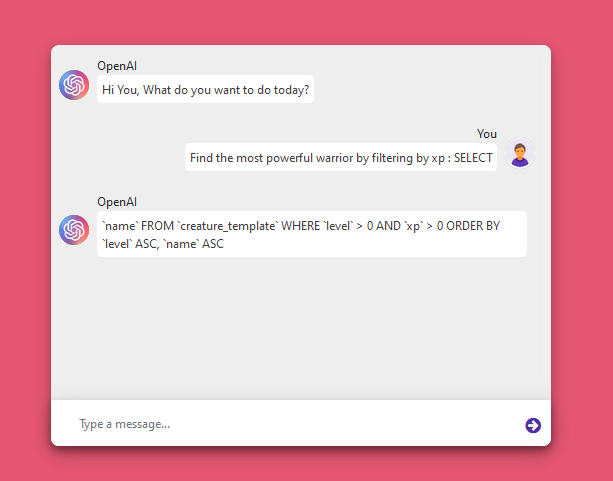
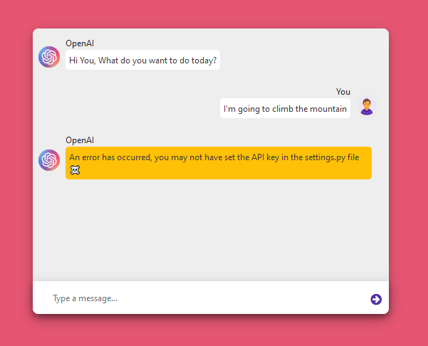

```
_______________________________________________________________________________________
   ____                   ___    ____            ____      _____    _   ____________ 
  / __ \____  ___  ____  /   |  /  _/           / __ \    / /   |  / | / / ____/ __ \
 / / / / __ \/ _ \/ __ \/ /| |  / /   ______   / / / /_  / / /| | /  |/ / / __/ / / /
/ /_/ / /_/ /  __/ / / / ___ |_/ /   /_____/  / /_/ / /_/ / ___ |/ /|  / /_/ / /_/ / 
\____/ .___/\___/_/ /_/_/  |_/___/           /_____/\____/_/  |_/_/ |_/\____/\____/  
    /_/                                                            by Martín Manso
______________________________________________________________________________________                                                                           
```

Requeriments
==============

- Python3
- Pip3
- OpenAI Api key -> [OpenAI site](https://beta.openai.com/)

Installation
=============

`pip3 install -requirements.txt`


Configuration
===============

When you get an openai key, you just have to enter in the OPENAI_KEY variable in the /mainapp/settings.py file (Not recommended for production environments)


Execution
================

`python3 manage.py runserver`


Examples
===============


